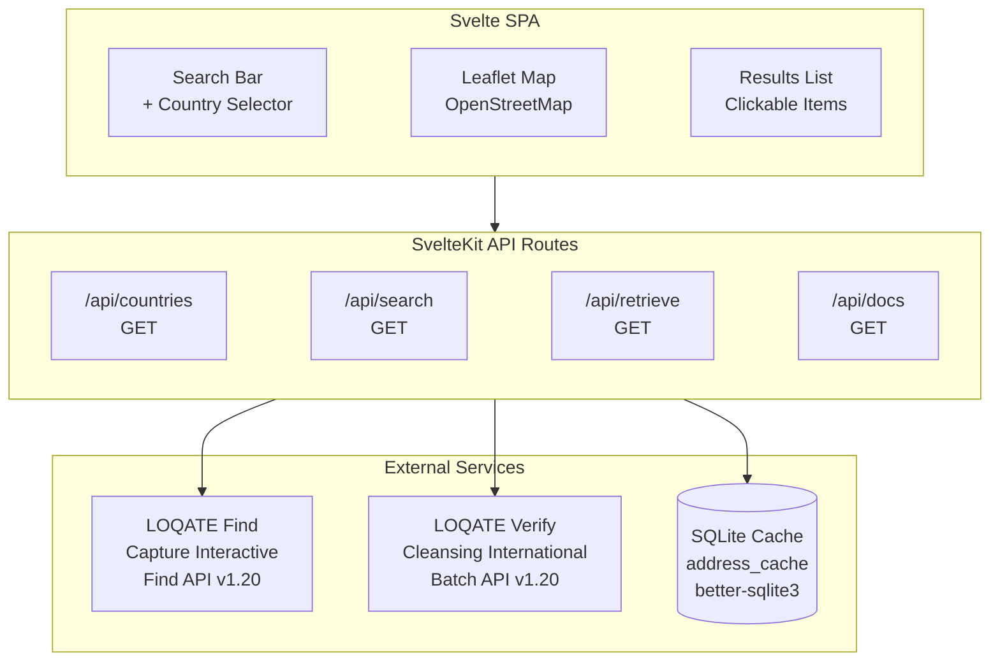
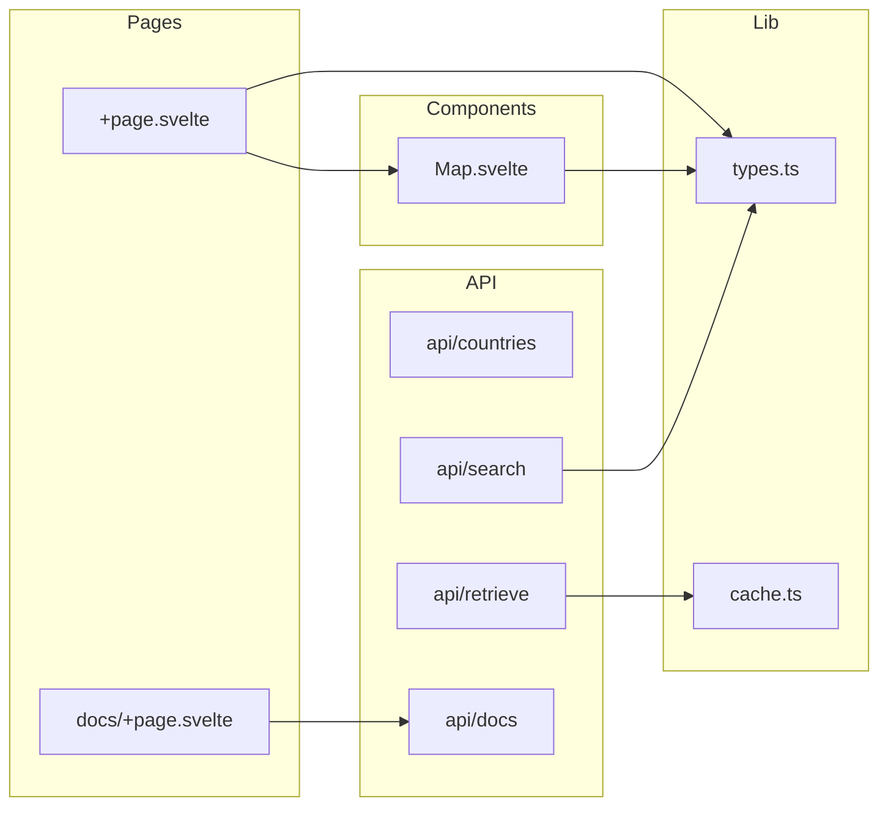
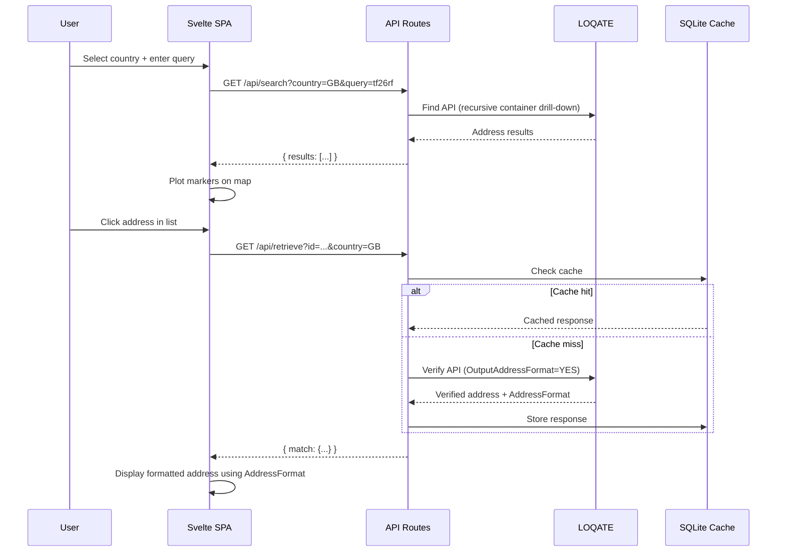
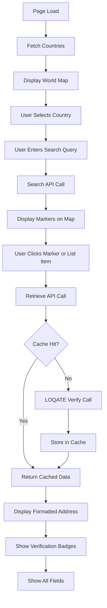

# POC Address Application Design

Architecture, data flow, and technology stack as presented on the POC Design tab of `outputs/international-addressing.html`.

## Architecture



## Component Diagram



## Data Flow

User Search → LOQATE Find → Map Markers → User Selects → Cache Check → LOQATE Verify → Formatted Address



## API Endpoints

| Endpoint | Method | Description |
|----------|--------|-------------|
| `/api/countries` | GET | List of countries with flags |
| `/api/search` | GET | Search addresses via LOQATE Find |
| `/api/retrieve` | GET | Get verified address via LOQATE Verify |
| `/api/docs` | GET | OpenAPI 3.0 JSON spec |
| `/docs` | GET | Swagger UI |

## Database Schema (Cache)

```sql
CREATE TABLE address_cache (
    id TEXT PRIMARY KEY,      -- Address ID from LOQATE Find
    response TEXT NOT NULL,   -- JSON blob of LOQATE Verify response
    created_at INTEGER NOT NULL -- Unix timestamp
);
```

## Address Formatting

The `AddressFormat` field from LOQATE defines how to construct the formatted address. It's a string with field names separated by `<BR>` tags.

**Example (UK):**

```
Organisation<BR>DeliveryAddress<BR>Locality AdministrativeArea PostalCode
```

**Rendering Logic:**

1. Split `AddressFormat` by `<BR>` to get lines
2. For each line, split by whitespace to get field names
3. Look up each field name in the LOQATE response
4. Join non-empty values with spaces

## Standard

Uses **UPU S42** (not ISO 20022). UPU S42 is more flexible, covers more countries, and is designed for web application adaptation.

## Technology Stack

| Layer | Technology |
|-------|-----------|
| Frontend | Svelte 5 + SvelteKit 2 |
| Map | Leaflet + OpenStreetMap |
| API | SvelteKit server routes |
| Cache | SQLite (better-sqlite3) |
| API Docs | Swagger UI |
| External | LOQATE Find + Verify APIs |

## User Flow




Related: [[Loqate-api]].
