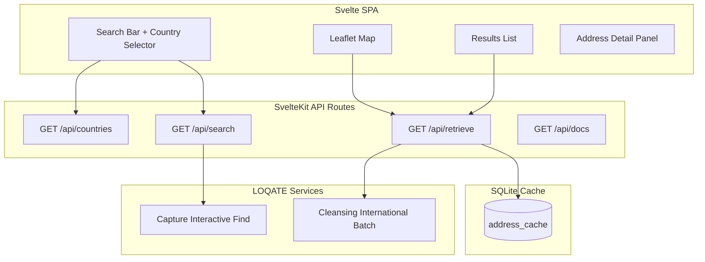
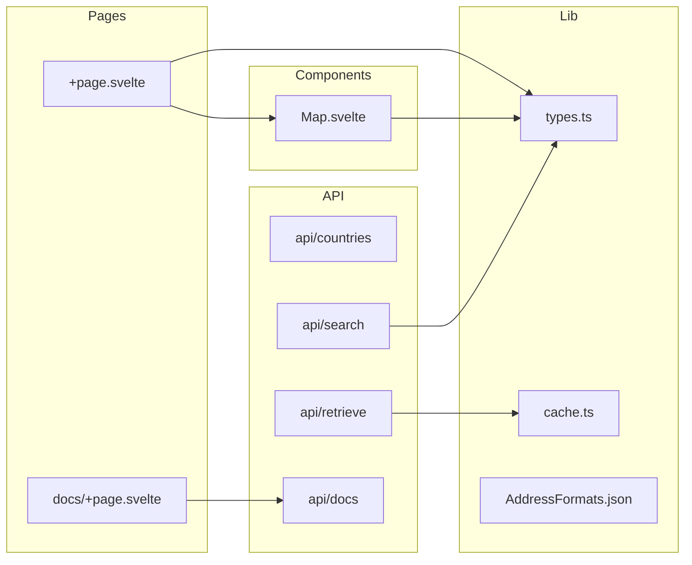
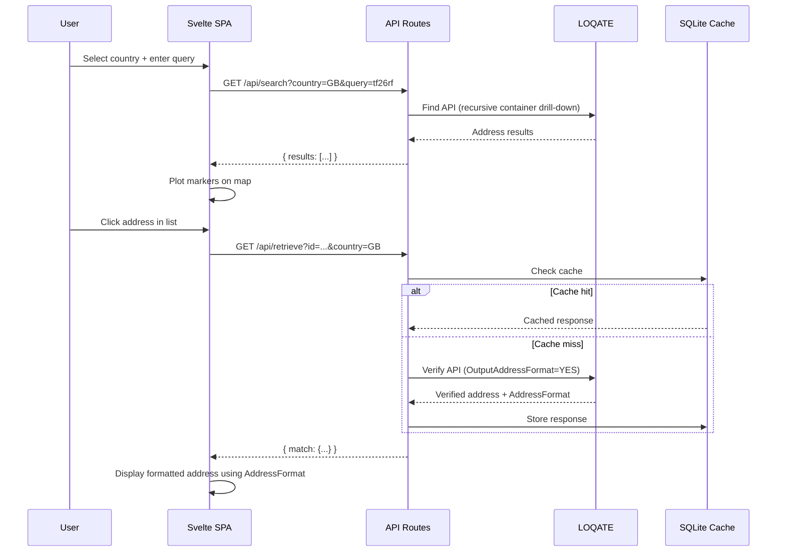
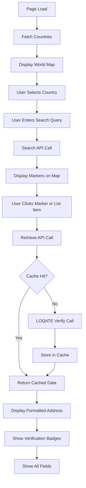
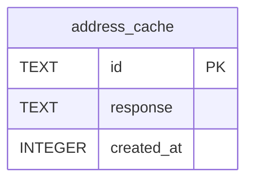

# POC Address — Design Documentation

## Overview

International address search and verification POC. Users search for addresses by country and query, view results on a map, and select a property to see LOQATE-verified address details.

## Architecture



## Component Diagram



## Data Flow



## User Flow



## API Endpoints

| Endpoint | Method | Description |
|----------|--------|-------------|
| `/api/countries` | GET | List of countries with flags |
| `/api/search` | GET | Search addresses via LOQATE Find |
| `/api/retrieve` | GET | Get verified address via LOQATE Verify |
| `/api/docs` | GET | OpenAPI 3.0 JSON spec |
| `/docs` | GET | Swagger UI |

## Database Schema



**Cache table:**
- `id` — Address ID from LOQATE Find (primary key)
- `response` — JSON blob of LOQATE Verify response
- `created_at` — Unix timestamp of cache entry

## LOQATE Integration

### Find API (Search)

```
GET https://api.addressy.com/Capture/Interactive/Find/v1.20/json6.ws
```

**Parameters:**
- `Key` — API key
- `Text` — Search text
- `Countries` — ISO 3166-1 alpha-2 code
- `Container` — Parent container ID (for recursive drill-down)
- `Limit` — Max results (100)

**Recursive flow:**
1. Search with `Text` + `Countries`
2. If result `Type` is not `Address`, use `Id` as `Container`
3. Repeat until `Type: "Address"` results returned

### Verify API (Retrieve)

```
POST https://api.addressy.com/Cleansing/International/Batch/v1.20/json6.ws
```

**Request body:**
```json
{
  "Key": "...",
  "GeoCode": true,
  "Addresses": [{
    "Id": "...",
    "Address": "...",
    "Address1": "...",
    "Locality": "...",
    "Country": "..."
  }],
  "Options": {
    "Process": "Verify",
    "Enhance": false,
    "ServerOptions": {
      "OutputAddressFormat": "YES"
    }
  }
}
```

**Key response fields:**
- `Address` — Full formatted address
- `AddressFormat` — Field mapping used to construct Address (string with `<BR>` separators)
- `Address1-8` — Individual address lines
- `Organisation`, `Building`, `Premise`, `Thoroughfare` — Address components
- `Locality`, `PostalCode`, `AdministrativeArea` — Location data
- `Latitude`, `Longitude`, `GeoAccuracy` — Geocoding
- `AVC`, `AQI`, `MatchScore` — Verification quality indicators

## Address Formatting

The `AddressFormat` field from LOQATE defines how to construct the formatted address. It's a string with field names separated by `<BR>` tags.

**Example (UK):**
```
Organisation<BR>DeliveryAddress<BR>Locality AdministrativeArea PostalCode
```

**Rendering logic:**
1. Split `AddressFormat` by `<BR>` to get lines
2. For each line, split by whitespace to get field names
3. Look up each field name in the LOQATE response
4. Join non-empty values with spaces

## Technology Stack

| Layer | Technology |
|-------|-----------|
| Frontend | Svelte 5 + SvelteKit 2 |
| Map | Leaflet + OpenStreetMap |
| API | SvelteKit server routes |
| Cache | SQLite (better-sqlite3) |
| API Docs | Swagger UI |
| External | LOQATE Find + Verify APIs |
